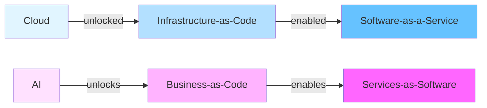

# Services-as-Software

## The Paradigm

Just as **Infrastructure-as-Code** enabled the **Software-as-a-Service** boom, **Business-as-Code** enables the **Services-as-Software** revolution.



## Core Concept

**Services-as-Software** is the delivery of professional services (previously performed by humans) through AI agents, expressed as executable code with guaranteed outcomes.

Instead of selling **software tools**, you sell **guaranteed outcomes**:
- Not "blog writing software" → "10 SEO-optimized blog posts per month"
- Not "design tools" → "Your brand identity in 3 days"
- Not "analytics platform" → "Weekly business insights report"

## The Foundation: ONET + GDPval

### ONET (Occupational Information Network)

**What:** Database of ~1,000 occupations sponsored by U.S. Department of Labor

**Contains:**
- **Tasks** - What work is actually performed
- **Skills** - Capabilities required
- **Knowledge** - Domains of expertise
- **Tools & Technologies** - What's used to perform work
- **Activities** - General work activities
- **Context** - Work environment, conditions

**Example: Software Developers (15-1252.00)**
```json
{
  "occupation": "Software Developers",
  "code": "15-1252.00",
  "tasks": [
    "Modify existing software to correct errors, adapt to new hardware, or improve performance",
    "Analyze user needs and develop software solutions, applying principles and techniques of computer science",
    "Develop and direct software system testing and validation procedures, programming, and documentation",
    // ... 30+ more tasks
  ],
  "skills": ["Programming", "Debugging", "Quality Control Analysis", "..."],
  "knowledge": ["Computers and Electronics", "Engineering and Technology", "..."],
  "tools": ["Development environment software", "Object or component oriented development software", "..."]
}
```

### GDPval (OpenAI Evaluation Framework)

**What:** Measures AI model performance on economically valuable, real-world tasks

**How it Works:**
1. Select top 9 GDP-contributing industries
2. Pick 5 key occupations per industry (from ONET)
3. Filter for "knowledge work" (≥60% non-physical tasks)
4. Create 1,320 real-world task evaluations
5. Human experts rate AI performance vs human baseline

**Connection to Services-as-Software:**
```typescript
// If AI scores ≥80% on GDPval task → deliverable as service
const occupation = onet.get('15-1252.00') // Software Developers
const tasks = occupation.tasks.filter(t => t.knowledgeWork)

for (const task of tasks) {
  const score = await gdpval.evaluate(aiModel, task)

  if (score >= 0.80) {
    // Can offer as service
    await platform.services.create({
      name: task.title,
      occupation: occupation.code,
      deliverable: task.output,
      pricing: calculatePricing(task.gdpContribution)
    })
  }
}
```

**Result:** Platform automatically discovers which services AI can deliver profitably

## TypeScript Interfaces

### Business Definition

```typescript
export interface Business {
  // Identity
  id: string
  name: string
  description: string
  domain?: string
  industry: string // NAICS code or name

  // Strategic
  vision: string
  mission: string
  storyBrand?: StoryBrand
  leanCanvas?: LeanCanvas

  // Objectives & Key Results
  okrs: OKR[]

  // Organization
  ceo: Human | Agent
  org: Department[]
  agents: Agent[]

  // Services Offered
  services: Service[]

  // Operations
  workflows: Workflow[]
  events: EventHandler[]
  schedules: Schedule[]

  // Integrations
  integrations: Integration[]

  // Metrics
  metrics: Metrics
  performance: Performance
}

export interface StoryBrand {
  hero: string // The customer
  problem: string // What they struggle with
  guide: string // Your brand as the guide
  solution: string // How you help
  callToAction: string // What they should do
  success: string // What success looks like
  failure: string // What failure looks like
  transformation: string // How they change
}

export interface LeanCanvas {
  problem: string[]
  customerSegments: string[]
  uniqueValueProposition: string
  solution: string[]
  channels: string[]
  revenueStreams: string[]
  costStructure: string[]
  keyMetrics: string[]
  unfairAdvantage: string
}
```

### Objectives & Key Results

```typescript
export interface OKR {
  objective: string
  keyResults: KeyResult[]
  owner: Agent | Human | Team
  timeframe: 'month' | 'quarter' | 'year'
  parent?: OKR
  children?: OKR[]
  status: 'active' | 'completed' | 'cancelled'
  startDate: Date
  endDate: Date
}

export interface KeyResult {
  metric: string
  current: number
  target: number
  unit: string
  progress: number // 0-100%
  trend: 'up' | 'down' | 'flat'
  confidence: number // 0-1
}

export interface KRProgress {
  date: Date
  value: number
  delta: number
  forecast: number // predicted end value
  onTrack: boolean
}
```

### Organization Structure

```typescript
export interface Department {
  name: string
  function: 'sales' | 'marketing' | 'product' | 'engineering' | 'customer-success' | 'operations' | 'finance'
  okr: OKR
  head: Human | Agent
  teams: Team[]
}

export interface Team {
  name: string
  okr: OKR
  manager: Human | Agent
  members: (Human | Agent)[]
  capacity: Capacity
}

export interface Capacity {
  total: number // total hours available
  allocated: number // hours assigned to tasks
  utilization: number // allocated / total
}

export interface Human {
  type: 'human'
  id: string
  name: string
  email: string
  role: string
  capabilities: string[] // ONET skills
  okr?: OKR
  workload: number // 0-1 (0% to 100%)
}

export interface Agent {
  type: 'agent'
  id: string
  name: string
  role: string
  capabilities: string[] // ONET skills
  model: 'gpt-4' | 'claude-3.5-sonnet' | 'llama-3.1'
  okr?: OKR
  performance: AgentPerformance
}

export interface AgentPerformance {
  tasksCompleted: number
  successRate: number // 0-1
  averageQuality: number // 0-10
  averageSpeed: number // tasks per hour
  costPerTask: number // dollars
  gdpvalScore?: number // 0-1 (AI capability on real-world tasks)
}
```

### Service Definition

```typescript
export interface Service {
  // Identity
  id: string
  name: string
  description: string

  // ONET Mapping
  occupation: string // ONET code (e.g., '15-1252.00')
  tasks: string[] // Specific ONET task IDs
  gdpvalScore?: number // 0-1 (AI capability)

  // Deliverable
  deliverable: Deliverable
  turnaroundTime: Duration
  quality: QualitySpec

  // Pricing
  pricing: PricingModel

  // Fulfillment
  fulfillmentWorkflow: Workflow
  assignedAgents: Agent[]
  backupHumans?: Human[]

  // SLA & Guarantees
  sla: SLA
  guarantees: Guarantee[]
}

export interface Deliverable {
  type: 'document' | 'code' | 'design' | 'analysis' | 'recording' | 'custom'
  format: string // e.g., 'markdown', 'typescript', 'figma', 'pdf'
  schema?: object // JSON schema for validation
  examples?: string[] // URLs to example deliverables
}

export interface Duration {
  value: number
  unit: 'hours' | 'days' | 'weeks'
}

export interface QualitySpec {
  criteria: QualityCriterion[]
  minimumScore: number // 0-10
  reviewProcess: 'automated' | 'human' | 'hybrid'
}

export interface QualityCriterion {
  name: string
  description: string
  weight: number // 0-1
  evaluator: 'ai' | 'human' | 'automated-test'
}

export interface SLA {
  responseTime: Duration
  resolutionTime: Duration
  uptime: number // 0-1 (e.g., 0.99 = 99%)
  refundPolicy: RefundPolicy
}

export interface Guarantee {
  type: 'satisfaction' | 'outcome' | 'timeline' | 'quality'
  description: string
  remedy: string // What happens if not met
}
```

### Pricing Models

```typescript
export type PricingModel =
  | CostBasedPricing
  | MarginBasedPricing
  | ActivityBasedPricing
  | OutcomeBasedPricing
  | SubscriptionPricing
  | UsageBased Pricing

// Cost + Fixed/Variable
export interface CostBasedPricing {
  model: 'cost-based'
  costBase: number // Base cost per unit
  fixedCosts: number // Fixed overhead
  variableCosts: number // Per-unit variable cost
  margin: number // Profit margin (0-1)
}

// Revenue = (Cost * Quantity * (1 + Margin%)) + Fixed
export function calculateCostBasedPrice(
  pricing: CostBasedPricing,
  quantity: number
): number {
  const totalCost = pricing.costBase * quantity + pricing.fixedCosts + pricing.variableCosts * quantity
  return totalCost * (1 + pricing.margin)
}

// Based on activities performed
export interface ActivityBasedPricing {
  model: 'activity-based'
  activities: Activity[]
}

export interface Activity {
  name: string // e.g., "research", "writing", "editing"
  rate: number // Price per unit of activity
  estimatedUnits: number // How many units typically needed
}

// Revenue = Σ(activity.rate * activity.units)
export function calculateActivityBasedPrice(
  pricing: ActivityBasedPricing,
  actualActivities: Record<string, number>
): number {
  return pricing.activities.reduce((total, activity) => {
    const units = actualActivities[activity.name] || activity.estimatedUnits
    return total + activity.rate * units
  }, 0)
}

// Based on outcomes achieved
export interface OutcomeBasedPricing {
  model: 'outcome-based'
  outcomes: Outcome[]
  basePrice: number // Minimum price if no outcomes met
}

export interface Outcome {
  metric: string // e.g., "conversion-rate", "engagement"
  targetValue: number
  price: number // Bonus if target met
  multiplier?: number // Price scales with achievement
}

// Revenue = base + Σ(outcome.price) for met targets
export function calculateOutcomeBasedPrice(
  pricing: OutcomeBasedPricing,
  actualOutcomes: Record<string, number>
): number {
  let total = pricing.basePrice

  for (const outcome of pricing.outcomes) {
    const actual = actualOutcomes[outcome.metric]
    if (actual >= outcome.targetValue) {
      if (outcome.multiplier) {
        total += outcome.price * (actual / outcome.targetValue)
      } else {
        total += outcome.price
      }
    }
  }

  return total
}

// Subscription
export interface SubscriptionPricing {
  model: 'subscription'
  interval: 'monthly' | 'quarterly' | 'yearly'
  price: number
  includedUnits: number // e.g., 10 blog posts per month
  overageRate: number // Price per additional unit
  tiers?: PricingTier[]
}

export interface PricingTier {
  name: string
  minUnits: number
  maxUnits?: number
  price: number
  features?: string[]
}

// Usage-based (pay-per-use)
export interface UsageBasedPricing {
  model: 'usage-based'
  unit: string // e.g., "API call", "word", "image"
  pricePerUnit: number
  minimumCharge?: number
  tiers?: UsageTier[]
}

export interface UsageTier {
  minUnits: number
  maxUnits?: number
  pricePerUnit: number
}
```

### Workflow & Execution

```typescript
export interface Workflow {
  id: string
  name: string
  trigger: Trigger
  steps: WorkflowStep[]
  errorHandling: ErrorHandler
}

export type Trigger =
  | { type: 'event'; event: string }
  | { type: 'schedule'; cron: string }
  | { type: 'webhook'; url: string }
  | { type: 'manual' }

export interface WorkflowStep {
  id: string
  name: string
  action: Action
  assignee: Agent | Human
  dependencies: string[] // Step IDs that must complete first
  timeout: Duration
  retryPolicy: RetryPolicy
}

export type Action =
  | { type: 'ai-generation'; prompt: string; model: string }
  | { type: 'api-call'; endpoint: string; method: string; body?: object }
  | { type: 'human-review'; instructions: string }
  | { type: 'quality-check'; criteria: QualityCriterion[] }
  | { type: 'notification'; channel: string; message: string }
  | { type: 'conditional'; condition: string; ifTrue: Action; ifFalse: Action }

export interface RetryPolicy {
  maxAttempts: number
  backoff: 'linear' | 'exponential'
  baseDelay: number // milliseconds
}

export interface ErrorHandler {
  onError: 'retry' | 'escalate' | 'skip' | 'fail'
  escalateTo?: Human
  notification?: string
}
```

### Order & Fulfillment

```typescript
export interface Order {
  id: string
  serviceId: string
  customer: Customer
  brief: object // Service-specific requirements
  status: OrderStatus
  createdAt: Date
  deadline: Date
  deliverable?: Deliverable
  price: number
  payment: Payment
}

export type OrderStatus =
  | 'pending' // Waiting to start
  | 'assigned' // Assigned to agent/human
  | 'in-progress' // Work underway
  | 'review' // Quality review
  | 'revisions' // Customer requested changes
  | 'completed' // Delivered
  | 'cancelled' // Cancelled before completion
  | 'refunded' // Completed but refunded

export interface Customer {
  id: string
  name: string
  email: string
  company?: string
  preferences?: object
  history: Order[]
}

export interface Payment {
  provider: 'stripe' | 'paypal'
  status: 'pending' | 'paid' | 'failed' | 'refunded'
  amount: number
  currency: string
  transactionId?: string
}
```

## Elegant API Design

### Creating a Business

```typescript
import { Business, Service, Agent } from './services-as-software'

const contentBusiness: Business = {
  name: 'AI Content Services',
  domain: 'content.ai',
  vision: 'Empower every business with world-class content',

  storyBrand: {
    hero: 'Busy founders overwhelmed by content demands',
    problem: 'No time to create content, poor quality from freelancers',
    guide: 'AI Content Services - your reliable content partner',
    solution: 'AI-powered content creation with human-level quality',
    callToAction: 'Get 10 blog posts delivered this month',
    success: 'Consistent, high-quality content driving growth',
    failure: 'Missed opportunities, poor brand reputation',
    transformation: 'From content-stressed to content-confident'
  },

  okrs: [
    {
      objective: 'Become the #1 AI content service',
      keyResults: [
        { metric: 'ARR', target: 10_000_000, unit: '$', current: 0, progress: 0, trend: 'flat', confidence: 0.5 },
        { metric: 'NPS', target: 80, unit: 'score', current: 0, progress: 0, trend: 'flat', confidence: 0.5 },
        { metric: 'Orders/month', target: 1000, unit: 'orders', current: 0, progress: 0, trend: 'flat', confidence: 0.5 }
      ],
      owner: { type: 'human', name: 'Alex', email: 'alex@content.ai', role: 'CEO' } as Human,
      timeframe: 'year',
      startDate: new Date('2025-01-01'),
      endDate: new Date('2025-12-31'),
      level: 'company',
      status: 'active',
      progress: 0,
      confidence: 0.5,
      health: 'yellow',
      history: [],
      lastUpdated: new Date()
    }
  ],

  services: [
    {
      name: 'SEO Blog Post',
      occupation: '27-3042.00', // Technical Writers (ONET code)
      tasks: ['Organize material and complete writing assignment', 'Conduct research'],
      gdpvalScore: 0.82,

      deliverable: {
        type: 'document',
        format: 'markdown',
        size: { min: 1500, max: 2500, unit: 'words' },
        specifications: [
          { name: 'Title', description: 'SEO-optimized title', required: true },
          { name: 'Keywords', description: 'Target keywords', required: true },
          { name: 'Meta Description', description: 'Search snippet', required: true }
        ]
      },

      turnaroundTime: { value: 48, unit: 'hours' },
      rushAvailable: true,

      pricing: {
        type: 'outcome-based',
        basePrice: 299,
        qualityTiers: [
          { minScore: 9.0, multiplier: 1.2, label: 'Premium' },
          { minScore: 8.0, multiplier: 1.0, label: 'Standard' }
        ]
      },

      quality: {
        criteria: [
          { id: 'seo', name: 'SEO Score', description: 'Surfer score ≥75', weight: 0.3, evaluator: 'automated-test', tool: 'Surfer', passingScore: 75 },
          { id: 'originality', name: 'Originality', description: 'Copyscape check', weight: 0.3, evaluator: 'automated-test', tool: 'Copyscape', passingScore: 95 }
        ],
        minimumScore: 8.0,
        reviewProcess: 'automated',
        acceptanceThreshold: 0.80
      },

      sla: {
        firstResponseTime: { value: 2, unit: 'hours' },
        resolutionTime: { value: 48, unit: 'hours' },
        uptime: 0.99,
        qualityGuarantee: 8.0,
        revisionLimit: 2,
        revisionTurnaround: { value: 24, unit: 'hours' },
        refundPolicy: {
          conditions: [{ condition: 'Quality < 6.0', refundAmount: 'full' }],
          process: 'Email support',
          turnaround: { value: 3, unit: 'days' }
        },
        reportingFrequency: 'daily',
        supportHours: {} as SupportHours
      }
    } as Service
  ]
}
```

### Event-Driven Operations - Elegant Proxy API

**New!** Semantic triple pattern with TypeScript Proxies (40-60% fewer tokens):

```typescript
// ═══════════════════════════════════════════════════════════
// PROXY-BASED API (Recommended) - Type-safe semantic triples
// ═══════════════════════════════════════════════════════════

// ═══ .on.category.event() - React to events ═══

// Order created → assign to agent
business.on.order.created(async (event, context) => {
  const { order } = event

  // Find best available agent
  const agent = await context.db.query(
    'SELECT * FROM agents WHERE status = ? ORDER BY performance DESC',
    ['idle']
  )

  await context.db.update('order', order.id, { assignedTo: agent.id })
  context.log(`Order ${order.id} assigned to ${agent.name}`)
})

// Payment received → update order
business.on.payment.received(async (event, context) => {
  await context.db.update('order', event.orderId, { status: 'paid' })
  await context.queue.send('process-order', { orderId: event.orderId })
})

// Agent overloaded → redistribute work
business.on.agent.overloaded(async (event, context) => {
  await context.slack.send('#ops', `⚠️ Agent ${event.agentId} overloaded`)
})

// ═══ .every.interval.at() - Scheduled tasks ═══

// Simple intervals
business.every.hour(async (context) => {
  const agents = await context.db.list('agent', {})
  const overloaded = agents.filter(a => a.currentLoad > 0.9)
  if (overloaded.length > 0) {
    await context.slack.send('#ops', `⚠️ ${overloaded.length} agents overloaded`)
  }
})

// Daily at specific time
business.every.day.at('06:00', async (context) => {
  const okr = await context.db.get('okr', 'q4-2025')
  const [mrr, customers] = await Promise.all([
    context.db.query('SELECT SUM(amount) FROM subscriptions'),
    context.db.query('SELECT COUNT(*) FROM customers WHERE status = ?', ['active'])
  ])

  okr.keyResults[0].current = mrr[0].sum
  okr.keyResults[1].current = customers[0].count
  await context.db.update('okr', okr.id, okr)
})

// Weekly on specific day
business.every.week.on.Mon.at('08:00', async (context) => {
  const report = await generateWeeklyReport(context)
  await context.email.send(
    context.business.ceo.email,
    'Weekly Report',
    report.summary
  )
})

// Monthly on specific day
business.every.month.on['1st'].at('00:00', async (context) => {
  const monthlyReport = await generateMonthlyReport(context)
  await context.slack.send('#leadership', monthlyReport)
})

// ═══ .forEachEntity.filter() - Bulk operations ═══

// Process all active customers
business.forEachCustomer.active(async (customer, context) => {
  const orders = customer.orders.filter(
    o => o.createdAt > Date.now() - 7 * 24 * 60 * 60 * 1000
  )
  if (orders.length > 0) {
    await context.email.send(customer.email, 'Weekly Summary', generateDigest(orders))
  }
})

// Escalate at-risk orders
business.forEachOrder['at-risk'](async (order, context) => {
  await context.slack.send('#operations', `🚨 Order ${order.id} at risk`)
  if (order.breaches.length > 2) {
    await context.db.update('order', order.id, { escalated: true, priority: 'urgent' })
  }
})

// Assign work to idle agents
business.forEachAgent.idle(async (agent, context) => {
  const pendingOrders = await context.db.list('order', { status: 'pending' })
  if (pendingOrders.length > 0) {
    const order = pendingOrders[0]
    await context.db.update('order', order.id, { assignedTo: agent.id })
  }
})

// ═══════════════════════════════════════════════════════════
// LEGACY STRING-BASED API (Still supported)
// ═══════════════════════════════════════════════════════════

// Old way (more tokens, no type safety):
business.on('order.created', async (event, context) => {
  const { order } = event

  // Find best available agent
  const agent = await context.db.query(
    'SELECT * FROM agents WHERE status = ? AND occupation = ? ORDER BY performance DESC LIMIT 1',
    ['idle', order.service.occupation]
  )

  // Assign order
  await context.db.update('order', order.id, {
    assignedTo: agent.id,
    status: 'assigned'
  })

  // Queue for processing
  await context.queue.send('process-order', { orderId: order.id, agentId: agent.id })

  context.log(`Order ${order.id} assigned to ${agent.name}`)
})

// Work completed → quality check
business.on('work.completed', async (event, context) => {
  const { orderId, deliverable, qualityScore } = event

  if (qualityScore >= 8.0) {
    // Deliver to customer
    await context.db.update('order', orderId, {
      status: 'completed',
      deliverable,
      qualityScore
    })

    // Send notification
    await context.email.send(
      event.customer.email,
      'Your order is ready!',
      'Click to view your deliverable...'
    )
  } else {
    // Request revisions
    const feedback = await context.ai.analyze(deliverable, 'What needs improvement?')

    await context.db.update('order', orderId, {
      status: 'revision',
      feedback
    })
  }
})

// ═══ .every() - Scheduled tasks ═══

// Daily OKR update at 6 AM
business.every('day at 06:00', async (context) => {
  context.log('Running daily OKR update...')

  // Calculate current metrics
  const [mrr, customers, nps, quality] = await Promise.all([
    context.db.query('SELECT SUM(amount) FROM subscriptions WHERE status = ?', ['active']),
    context.db.query('SELECT COUNT(*) FROM customers WHERE status = ?', ['active']),
    calculateNPS(context),
    calculateAvgQuality(context)
  ])

  // Update OKR progress
  const okr = await context.db.get('okr', 'q4-2025')
  okr.keyResults[0].current = mrr[0].sum
  okr.keyResults[1].current = customers[0].count
  okr.keyResults[2].current = nps
  okr.progress = calculateProgress(okr.keyResults)

  await context.db.update('okr', okr.id, okr)

  // Alert if at-risk
  if (okr.health === 'red') {
    await context.slack.send('#leadership', `⚠️ OKR at risk: ${okr.objective}`)
  }
})

// Weekly report on Monday at 8 AM
business.every('week on Mon at 08:00', async (context) => {
  const report = await generateWeeklyReport(context)

  await context.email.send(
    context.business.ceo.email,
    `Weekly Report - ${new Date().toISOString().slice(0, 10)}`,
    report.summary,
    { attachments: [{ filename: 'report.pdf', content: report.pdf }] }
  )
})

// Hourly capacity check
business.every('hour', async (context) => {
  const agents = await context.db.list('agent', {})
  const overloaded = agents.filter(a => a.currentLoad > 0.9)

  if (overloaded.length > 0) {
    await context.slack.send('#ops', `⚠️ ${overloaded.length} agents overloaded`)
  }
})

// ═══ .send() - Send messages ═══

// Email notification
business.send({
  to: 'email',
  recipient: 'customer@example.com',
  subject: 'Order Complete',
  body: 'Your content is ready for review!',
  template: 'order-complete',
  variables: { orderId: '123', deliveryUrl: 'https://...' }
})

// Slack notification
business.send({
  to: 'slack',
  channel: '#orders',
  text: 'New order received!',
  blocks: [/* Slack block kit */]
})

// Queue message
business.send({
  to: 'queue',
  queue: 'process-order',
  message: { orderId: '123', priority: 'high' },
  delay: 5000 // 5 second delay
})

// ═══ .forEach() - Bulk operations ═══

// Process all pending orders
business.forEach('Order.pending', async (order, context) => {
  const agent = findBestAgent(context.agents, order.requirements)
  await context.db.update('order', order.id, { assignedTo: agent.id })
})

// Check all at-risk orders
business.forEach('Order.at-risk', async (order, context) => {
  await context.slack.send('#operations', `⚠️ Order ${order.id} at risk`)

  // Escalate to human
  if (order.breaches.length > 2) {
    await context.db.update('order', order.id, { escalated: true })
  }
})

// Send weekly digest to all active customers
business.forEach('Customer.active', async (customer, context) => {
  const recentOrders = customer.orders.filter(
    o => o.createdAt > new Date(Date.now() - 7 * 24 * 60 * 60 * 1000)
  )

  if (recentOrders.length > 0) {
    await context.email.send(
      customer.email,
      'Your Weekly Summary',
      generateCustomerDigest(customer, recentOrders)
    )
  }
})
```

## Integration with Infrastructure-as-Code

```typescript
// Business-as-Code builds on Infrastructure-as-Code
import { Business } from '@do/business-as-code'
import { Infrastructure } from '@do/infrastructure' // Terraform/Pulumi wrapper

const business = Business({ /* ... */ })

// Auto-generate infrastructure
const infrastructure = await Infrastructure.fromBusiness(business, {
  provider: 'cloudflare',
  regions: ['global'],
  features: {
    compute: 'workers', // Cloudflare Workers
    database: 'neon', // Neon Postgres
    storage: 'r2', // Cloudflare R2
    queue: 'cloudflare-queues',
    cdn: 'cloudflare-cdn',
    dns: 'cloudflare-dns'
  }
})

// Generate Terraform/Pulumi config
const terraformConfig = infrastructure.toTerraform()
const pulumiConfig = infrastructure.toPulumi()

// Or deploy directly
await infrastructure.deploy()

// Result: Complete infrastructure provisioned
// - Custom domain with SSL
// - Database with schema migrated
// - Workers deployed for all services
// - Queue consumers running
// - API gateway configured
// - Webhooks registered
// - Payments connected (Stripe)
```

## Folder Structure

This folder contains the complete TypeScript implementation of the Services-as-Software framework:

```
services-as-software/
├── README.mdx                    # This file - framework overview
├── index.ts                      # Main exports and documentation
│
├── types/                        # Core TypeScript type definitions
│   ├── business.ts              # Business, OKR, Metrics, Performance types
│   ├── service.ts               # Service, Deliverable, Quality, SLA types
│   ├── pricing.ts               # 10 pricing models with calculation functions
│   ├── workflow.ts              # Event-driven API (.on, .every, .send, .forEach)
│   ├── agent.ts                 # Agent, Human, Team, Department types
│   └── order.ts                 # Order, Customer, Payment, Invoice types
│
└── examples/                     # Complete implementation examples
    └── content-agency.ts        # Full AI Content Agency implementation
                                 # - Business definition with OKRs
                                 # - Service catalog (SEO blog posts)
                                 # - AI agent workforce
                                 # - Event handlers and workflows
                                 # - Complete order fulfillment flow

# Coming Soon (placeholders for future development):
├── pricing/                      # Pricing strategy guides
│   ├── models.md                # Detailed pricing model documentation
│   ├── gdp-valuation.md         # GDP-based pricing methodology
│   └── calculators.ts           # Advanced pricing calculators
│
├── quality/                      # Quality assessment framework
│   ├── criteria.md              # Quality standards and benchmarks
│   ├── evaluators.ts            # Automated quality check implementations
│   └── gdpval-integration.md    # GDPval evaluation integration guide
│
├── delivery/                     # Delivery workflows and SLAs
│   ├── workflows.md             # Standard delivery patterns
│   ├── sla.md                   # SLA templates and enforcement
│   └── guarantees.md            # Service guarantee templates
│
└── tasks/                        # ONET task mapping
    ├── onet-mapping.md          # ONET occupation → service mapping guide
    ├── task-definitions.ts      # Task specifications and schemas
    └── capability-matrix.md     # AI vs human capability analysis
```

## What's Implemented

✅ **Complete Core Type System** (6 files, 2,500+ lines)
- Business structure with StoryBrand, Lean Canvas, OKRs
- Service definitions mapped to ONET occupations
- 10 pricing models with calculation functions
- Event-driven workflow API (.on, .every, .send, .forEach)
- Agent/human/team organization with performance tracking
- Order management, customer relations, payment processing

✅ **Comprehensive Example** (content-agency.ts, 800+ lines)
- AI Content Agency selling SEO blog posts
- Complete business definition ($600K ARR, 8:1 LTV/CAC)
- Service catalog with ONET mapping and GDPval (0.82 score)
- AI agent workforce (GPT-4 writer with 8.6 quality avg)
- Event handlers (order assignment, quality checks)
- Scheduled tasks (daily OKR updates, weekly reports)

✅ **Developer-Friendly Exports** (index.ts)
- All types exported with full documentation
- Utility functions for common operations
- Constants and benchmarks
- Service templates (Blog, Logo, Code Review)
- JSDoc documentation with examples

## Further Reading

- [Business-as-Code Documentation](/docs/business/Business-as-Code.mdx)
- [ONET Database](https://www.onetonline.org/)
- [GDPval Paper](https://cdn.openai.com/pdf/d5eb7428-c4e9-4a33-bd86-86dd4bcf12ce/GDPval.pdf)
- [Infrastructure-as-Code Guides](/docs/cloud/)

## Questions?

Open an issue or discussion in the [GitHub repository](https://github.com/dot-do/.do).
