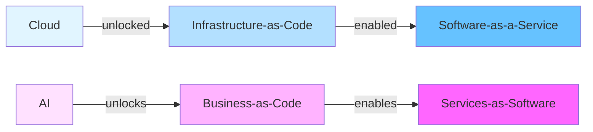

# Services-as-Software

## The Paradigm

Just as **Infrastructure-as-Code** enabled the **Software-as-a-Service** boom, **Business-as-Code** enables the **Services-as-Software** revolution.



## Core Concept

**Services-as-Software** is the delivery of professional services (previously performed by humans) through AI agents, expressed as executable code with guaranteed outcomes.

Instead of selling **software tools**, you sell **guaranteed outcomes**:
- Not "blog writing software" → "10 SEO-optimized blog posts per month"
- Not "design tools" → "Your brand identity in 3 days"
- Not "analytics platform" → "Weekly business insights report"

## The Foundation: ONET + GDPval

### ONET (Occupational Information Network)

**What:** Database of ~1,000 occupations sponsored by U.S. Department of Labor

**Contains:**
- **Tasks** - What work is actually performed
- **Skills** - Capabilities required
- **Knowledge** - Domains of expertise
- **Tools & Technologies** - What's used to perform work
- **Activities** - General work activities
- **Context** - Work environment, conditions

**Example: Software Developers (15-1252.00)**
```json
{
  "occupation": "Software Developers",
  "code": "15-1252.00",
  "tasks": [
    "Modify existing software to correct errors, adapt to new hardware, or improve performance",
    "Analyze user needs and develop software solutions, applying principles and techniques of computer science",
    "Develop and direct software system testing and validation procedures, programming, and documentation",
    // ... 30+ more tasks
  ],
  "skills": ["Programming", "Debugging", "Quality Control Analysis", "..."],
  "knowledge": ["Computers and Electronics", "Engineering and Technology", "..."],
  "tools": ["Development environment software", "Object or component oriented development software", "..."]
}
```

### GDPval (OpenAI Evaluation Framework)

**What:** Measures AI model performance on economically valuable, real-world tasks

**How it Works:**
1. Select top 9 GDP-contributing industries
2. Pick 5 key occupations per industry (from ONET)
3. Filter for "knowledge work" (≥60% non-physical tasks)
4. Create 1,320 real-world task evaluations
5. Human experts rate AI performance vs human baseline

**Connection to Services-as-Software:**
```typescript
// If AI scores ≥80% on GDPval task → deliverable as service
const occupation = onet.get('15-1252.00') // Software Developers
const tasks = occupation.tasks.filter(t => t.knowledgeWork)

for (const task of tasks) {
  const score = await gdpval.evaluate(aiModel, task)

  if (score >= 0.80) {
    // Can offer as service
    await platform.services.create({
      name: task.title,
      occupation: occupation.code,
      deliverable: task.output,
      pricing: calculatePricing(task.gdpContribution)
    })
  }
}
```

**Result:** Platform automatically discovers which services AI can deliver profitably

## TypeScript Interfaces

### Business Definition

```typescript
export interface Business {
  // Identity
  id: string
  name: string
  description: string
  domain?: string
  industry: string // NAICS code or name

  // Strategic
  vision: string
  mission: string
  storyBrand?: StoryBrand
  leanCanvas?: LeanCanvas

  // Objectives & Key Results
  okrs: OKR[]

  // Organization
  ceo: Human | Agent
  org: Department[]
  agents: Agent[]

  // Services Offered
  services: Service[]

  // Operations
  workflows: Workflow[]
  events: EventHandler[]
  schedules: Schedule[]

  // Integrations
  integrations: Integration[]

  // Metrics
  metrics: Metrics
  performance: Performance
}

export interface StoryBrand {
  hero: string // The customer
  problem: string // What they struggle with
  guide: string // Your brand as the guide
  solution: string // How you help
  callToAction: string // What they should do
  success: string // What success looks like
  failure: string // What failure looks like
  transformation: string // How they change
}

export interface LeanCanvas {
  problem: string[]
  customerSegments: string[]
  uniqueValueProposition: string
  solution: string[]
  channels: string[]
  revenueStreams: string[]
  costStructure: string[]
  keyMetrics: string[]
  unfairAdvantage: string
}
```

### Objectives & Key Results

```typescript
export interface OKR {
  objective: string
  keyResults: KeyResult[]
  owner: Agent | Human | Team
  timeframe: 'month' | 'quarter' | 'year'
  parent?: OKR
  children?: OKR[]
  status: 'active' | 'completed' | 'cancelled'
  startDate: Date
  endDate: Date
}

export interface KeyResult {
  metric: string
  current: number
  target: number
  unit: string
  progress: number // 0-100%
  trend: 'up' | 'down' | 'flat'
  confidence: number // 0-1
}

export interface KRProgress {
  date: Date
  value: number
  delta: number
  forecast: number // predicted end value
  onTrack: boolean
}
```

### Organization Structure

```typescript
export interface Department {
  name: string
  function: 'sales' | 'marketing' | 'product' | 'engineering' | 'customer-success' | 'operations' | 'finance'
  okr: OKR
  head: Human | Agent
  teams: Team[]
}

export interface Team {
  name: string
  okr: OKR
  manager: Human | Agent
  members: (Human | Agent)[]
  capacity: Capacity
}

export interface Capacity {
  total: number // total hours available
  allocated: number // hours assigned to tasks
  utilization: number // allocated / total
}

export interface Human {
  type: 'human'
  id: string
  name: string
  email: string
  role: string
  capabilities: string[] // ONET skills
  okr?: OKR
  workload: number // 0-1 (0% to 100%)
}

export interface Agent {
  type: 'agent'
  id: string
  name: string
  role: string
  capabilities: string[] // ONET skills
  model: 'gpt-4' | 'claude-3.5-sonnet' | 'llama-3.1'
  okr?: OKR
  performance: AgentPerformance
}

export interface AgentPerformance {
  tasksCompleted: number
  successRate: number // 0-1
  averageQuality: number // 0-10
  averageSpeed: number // tasks per hour
  costPerTask: number // dollars
  gdpvalScore?: number // 0-1 (AI capability on real-world tasks)
}
```

### Service Definition

```typescript
export interface Service {
  // Identity
  id: string
  name: string
  description: string

  // ONET Mapping
  occupation: string // ONET code (e.g., '15-1252.00')
  tasks: string[] // Specific ONET task IDs
  gdpvalScore?: number // 0-1 (AI capability)

  // Deliverable
  deliverable: Deliverable
  turnaroundTime: Duration
  quality: QualitySpec

  // Pricing
  pricing: PricingModel

  // Fulfillment
  fulfillmentWorkflow: Workflow
  assignedAgents: Agent[]
  backupHumans?: Human[]

  // SLA & Guarantees
  sla: SLA
  guarantees: Guarantee[]
}

export interface Deliverable {
  type: 'document' | 'code' | 'design' | 'analysis' | 'recording' | 'custom'
  format: string // e.g., 'markdown', 'typescript', 'figma', 'pdf'
  schema?: object // JSON schema for validation
  examples?: string[] // URLs to example deliverables
}

export interface Duration {
  value: number
  unit: 'hours' | 'days' | 'weeks'
}

export interface QualitySpec {
  criteria: QualityCriterion[]
  minimumScore: number // 0-10
  reviewProcess: 'automated' | 'human' | 'hybrid'
}

export interface QualityCriterion {
  name: string
  description: string
  weight: number // 0-1
  evaluator: 'ai' | 'human' | 'automated-test'
}

export interface SLA {
  responseTime: Duration
  resolutionTime: Duration
  uptime: number // 0-1 (e.g., 0.99 = 99%)
  refundPolicy: RefundPolicy
}

export interface Guarantee {
  type: 'satisfaction' | 'outcome' | 'timeline' | 'quality'
  description: string
  remedy: string // What happens if not met
}
```

### Pricing Models

```typescript
export type PricingModel =
  | CostBasedPricing
  | MarginBasedPricing
  | ActivityBasedPricing
  | OutcomeBasedPricing
  | SubscriptionPricing
  | UsageBased Pricing

// Cost + Fixed/Variable
export interface CostBasedPricing {
  model: 'cost-based'
  costBase: number // Base cost per unit
  fixedCosts: number // Fixed overhead
  variableCosts: number // Per-unit variable cost
  margin: number // Profit margin (0-1)
}

// Revenue = (Cost * Quantity * (1 + Margin%)) + Fixed
export function calculateCostBasedPrice(
  pricing: CostBasedPricing,
  quantity: number
): number {
  const totalCost = pricing.costBase * quantity + pricing.fixedCosts + pricing.variableCosts * quantity
  return totalCost * (1 + pricing.margin)
}

// Based on activities performed
export interface ActivityBasedPricing {
  model: 'activity-based'
  activities: Activity[]
}

export interface Activity {
  name: string // e.g., "research", "writing", "editing"
  rate: number // Price per unit of activity
  estimatedUnits: number // How many units typically needed
}

// Revenue = Σ(activity.rate * activity.units)
export function calculateActivityBasedPrice(
  pricing: ActivityBasedPricing,
  actualActivities: Record<string, number>
): number {
  return pricing.activities.reduce((total, activity) => {
    const units = actualActivities[activity.name] || activity.estimatedUnits
    return total + activity.rate * units
  }, 0)
}

// Based on outcomes achieved
export interface OutcomeBasedPricing {
  model: 'outcome-based'
  outcomes: Outcome[]
  basePrice: number // Minimum price if no outcomes met
}

export interface Outcome {
  metric: string // e.g., "conversion-rate", "engagement"
  targetValue: number
  price: number // Bonus if target met
  multiplier?: number // Price scales with achievement
}

// Revenue = base + Σ(outcome.price) for met targets
export function calculateOutcomeBasedPrice(
  pricing: OutcomeBasedPricing,
  actualOutcomes: Record<string, number>
): number {
  let total = pricing.basePrice

  for (const outcome of pricing.outcomes) {
    const actual = actualOutcomes[outcome.metric]
    if (actual >= outcome.targetValue) {
      if (outcome.multiplier) {
        total += outcome.price * (actual / outcome.targetValue)
      } else {
        total += outcome.price
      }
    }
  }

  return total
}

// Subscription
export interface SubscriptionPricing {
  model: 'subscription'
  interval: 'monthly' | 'quarterly' | 'yearly'
  price: number
  includedUnits: number // e.g., 10 blog posts per month
  overageRate: number // Price per additional unit
  tiers?: PricingTier[]
}

export interface PricingTier {
  name: string
  minUnits: number
  maxUnits?: number
  price: number
  features?: string[]
}

// Usage-based (pay-per-use)
export interface UsageBasedPricing {
  model: 'usage-based'
  unit: string // e.g., "API call", "word", "image"
  pricePerUnit: number
  minimumCharge?: number
  tiers?: UsageTier[]
}

export interface UsageTier {
  minUnits: number
  maxUnits?: number
  pricePerUnit: number
}
```

### Workflow & Execution

```typescript
export interface Workflow {
  id: string
  name: string
  trigger: Trigger
  steps: WorkflowStep[]
  errorHandling: ErrorHandler
}

export type Trigger =
  | { type: 'event'; event: string }
  | { type: 'schedule'; cron: string }
  | { type: 'webhook'; url: string }
  | { type: 'manual' }

export interface WorkflowStep {
  id: string
  name: string
  action: Action
  assignee: Agent | Human
  dependencies: string[] // Step IDs that must complete first
  timeout: Duration
  retryPolicy: RetryPolicy
}

export type Action =
  | { type: 'ai-generation'; prompt: string; model: string }
  | { type: 'api-call'; endpoint: string; method: string; body?: object }
  | { type: 'human-review'; instructions: string }
  | { type: 'quality-check'; criteria: QualityCriterion[] }
  | { type: 'notification'; channel: string; message: string }
  | { type: 'conditional'; condition: string; ifTrue: Action; ifFalse: Action }

export interface RetryPolicy {
  maxAttempts: number
  backoff: 'linear' | 'exponential'
  baseDelay: number // milliseconds
}

export interface ErrorHandler {
  onError: 'retry' | 'escalate' | 'skip' | 'fail'
  escalateTo?: Human
  notification?: string
}
```

### Order & Fulfillment

```typescript
export interface Order {
  id: string
  serviceId: string
  customer: Customer
  brief: object // Service-specific requirements
  status: OrderStatus
  createdAt: Date
  deadline: Date
  deliverable?: Deliverable
  price: number
  payment: Payment
}

export type OrderStatus =
  | 'pending' // Waiting to start
  | 'assigned' // Assigned to agent/human
  | 'in-progress' // Work underway
  | 'review' // Quality review
  | 'revisions' // Customer requested changes
  | 'completed' // Delivered
  | 'cancelled' // Cancelled before completion
  | 'refunded' // Completed but refunded

export interface Customer {
  id: string
  name: string
  email: string
  company?: string
  preferences?: object
  history: Order[]
}

export interface Payment {
  provider: 'stripe' | 'paypal'
  status: 'pending' | 'paid' | 'failed' | 'refunded'
  amount: number
  currency: string
  transactionId?: string
}
```

## Elegant API Design

### Creating a Business

```typescript
import { Business, Agent, Human, Service } from '@do/business-as-code'

const contentBusiness = Business({
  name: 'AI Content Services',
  domain: 'content.ai',
  vision: 'Empower every business with world-class content',

  storyBrand: {
    hero: 'Busy founders overwhelmed by content demands',
    problem: 'No time to create content, poor quality from freelancers',
    guide: 'AI Content Services - your reliable content partner',
    solution: 'AI-powered content creation with human-level quality',
    callToAction: 'Get 10 blog posts delivered this month',
    success: 'Consistent, high-quality content driving growth',
    failure: 'Missed opportunities, poor brand reputation',
    transformation: 'From content-stressed to content-confident'
  },

  okrs: [
    {
      objective: 'Become the #1 AI content service',
      keyResults: [
        { metric: 'ARR', target: 10_000_000, unit: '$', current: 0 },
        { metric: 'NPS', target: 80, unit: 'score', current: 0 },
        { metric: 'Orders/month', target: 1000, unit: 'orders', current: 0 }
      ],
      timeframe: 'year',
      owner: Human({ name: 'Alex', email: 'alex@content.ai', role: 'CEO' })
    }
  ],

  services: [
    Service({
      name: 'SEO Blog Post',
      occupation: '27-3042.00', // Technical Writers (ONET code)
      tasks: ['15356', '15357'], // Specific ONET task IDs

      deliverable: {
        type: 'document',
        format: 'markdown',
        schema: {
          title: 'string',
          body: 'string (1500-2500 words)',
          keywords: 'string[]',
          metaDescription: 'string'
        }
      },

      turnaroundTime: { value: 3, unit: 'days' },

      pricing: {
        model: 'cost-based',
        costBase: 50, // AI cost + overhead
        fixedCosts: 25,
        variableCosts: 10,
        margin: 0.5 // 50% margin
      },

      quality: {
        criteria: [
          {
            name: 'SEO Score',
            weight: 0.3,
            evaluator: 'automated-test',
            description: 'Yoast SEO score ≥ 80'
          },
          {
            name: 'Readability',
            weight: 0.2,
            evaluator: 'automated-test',
            description: 'Flesch reading ease ≥ 60'
          },
          {
            name: 'Originality',
            weight: 0.3,
            evaluator: 'automated-test',
            description: 'Copyscape check passes'
          },
          {
            name: 'Relevance',
            weight: 0.2,
            evaluator: 'ai',
            description: 'Content matches brief'
          }
        ],
        minimumScore: 8.0,
        reviewProcess: 'automated'
      },

      sla: {
        responseTime: { value: 1, unit: 'hours' },
        resolutionTime: { value: 3, unit: 'days' },
        uptime: 0.99,
        refundPolicy: {
          condition: 'Quality score < 7.0',
          refund: 'full'
        }
      }
    })
  ],

  agents: [
    Agent({
      name: 'Writer-1',
      role: 'Content Writer',
      model: 'gpt-4',
      capabilities: ['blog_writing', 'seo_optimization', 'research'],
      okr: {
        objective: 'Deliver 100 high-quality posts/month',
        keyResults: [
          { metric: 'Posts', target: 100, unit: 'posts', current: 0 },
          { metric: 'Quality', target: 9.0, unit: 'score', current: 0 },
          { metric: 'On-time', target: 0.95, unit: '%', current: 0 }
        ],
        timeframe: 'month',
        owner: this // self
      }
    })
  ]
})

// Deploy
await contentBusiness.deploy({
  regions: ['us-east', 'eu-west'],
  features: ['payments', 'dashboard', 'api', 'webhooks']
})

// Start operating
await contentBusiness.start()
```

### Event-Driven Operations

```typescript
// Order created → assign to agent
contentBusiness.on('order.created', async (order) => {
  const availableAgent = await contentBusiness.agents.findAvailable({
    capability: 'blog_writing',
    load: '<0.8'
  })

  await availableAgent.assign({
    orderId: order.id,
    deadline: order.deadline,
    brief: order.brief
  })
})

// Work completed → quality check
contentBusiness.on('work.completed', async ({ orderId, deliverable }) => {
  const qualityScore = await contentBusiness.quality.check(deliverable)

  if (qualityScore >= 8.0) {
    await contentBusiness.orders.deliver(orderId, deliverable)
  } else {
    // Revisions needed
    await contentBusiness.orders.requestRevisions(orderId, {
      reason: 'Quality below threshold',
      score: qualityScore,
      feedback: await ai.generateFeedback(deliverable)
    })
  }
})

// Daily OKR review
contentBusiness.every('day at 06:00', async () => {
  const progress = await contentBusiness.okrs.calculateProgress()

  if (progress < 70) {
    // Behind on goals - AI generates action plan
    const plan = await ai.generateRecoveryPlan({
      okrs: contentBusiness.okrs,
      progress,
      constraints: contentBusiness.resources
    })

    // Execute plan
    for (const action of plan.actions) {
      await contentBusiness.execute(action)
    }

    // Notify CEO
    await slack.send({
      channel: '#alerts',
      message: `⚠️ Behind on OKRs (${progress}%). Executing recovery plan.`,
      attachments: [plan]
    })
  }
})

// Weekly report to stakeholders
contentBusiness.every('week on Mon at 08:00', async () => {
  const report = await contentBusiness.reports.generate('weekly')

  await email.send({
    to: [contentBusiness.ceo.email],
    subject: `Weekly Report: ${report.period}`,
    body: report.summary,
    attachments: [report.details]
  })
})
```

## Integration with Infrastructure-as-Code

```typescript
// Business-as-Code builds on Infrastructure-as-Code
import { Business } from '@do/business-as-code'
import { Infrastructure } from '@do/infrastructure' // Terraform/Pulumi wrapper

const business = Business({ /* ... */ })

// Auto-generate infrastructure
const infrastructure = await Infrastructure.fromBusiness(business, {
  provider: 'cloudflare',
  regions: ['global'],
  features: {
    compute: 'workers', // Cloudflare Workers
    database: 'neon', // Neon Postgres
    storage: 'r2', // Cloudflare R2
    queue: 'cloudflare-queues',
    cdn: 'cloudflare-cdn',
    dns: 'cloudflare-dns'
  }
})

// Generate Terraform/Pulumi config
const terraformConfig = infrastructure.toTerraform()
const pulumiConfig = infrastructure.toPulumi()

// Or deploy directly
await infrastructure.deploy()

// Result: Complete infrastructure provisioned
// - Custom domain with SSL
// - Database with schema migrated
// - Workers deployed for all services
// - Queue consumers running
// - API gateway configured
// - Webhooks registered
// - Payments connected (Stripe)
```

## Folder Structure

This folder contains TypeScript definitions and implementation guides:

```
services-as-software/
├── README.mdx (this file)
├── types/
│   ├── business.ts - Business, OKR, Organization types
│   ├── service.ts - Service, Deliverable, Quality types
│   ├── pricing.ts - Pricing models and calculations
│   ├── workflow.ts - Workflow, Action, Trigger types
│   ├── agent.ts - Agent, Human, Performance types
│   └── order.ts - Order, Customer, Payment types
├── examples/
│   ├── content-service.ts - Full content business example
│   ├── design-service.ts - Design agency example
│   ├── consulting-service.ts - Consulting firm example
│   └── data-service.ts - Data analysis service
├── pricing/
│   ├── models.md - Pricing strategy guide
│   ├── gdp-valuation.md - GDP-based pricing
│   └── calculators.ts - Pricing calculation utilities
├── quality/
│   ├── criteria.md - Quality assessment framework
│   ├── evaluators.ts - Automated quality checks
│   └── gdpval-integration.md - GDPval evaluation
├── delivery/
│   ├── workflows.md - Standard delivery workflows
│   ├── sla.md - SLA templates and enforcement
│   └── guarantees.md - Service guarantees
└── tasks/
    ├── onet-mapping.md - ONET occupation → service mapping
    ├── task-definitions.ts - Task specifications
    └── capability-matrix.md - AI vs human capabilities
```

## Further Reading

- [Business-as-Code Documentation](/docs/business/Business-as-Code.mdx)
- [ONET Database](https://www.onetonline.org/)
- [GDPval Paper](https://cdn.openai.com/pdf/d5eb7428-c4e9-4a33-bd86-86dd4bcf12ce/GDPval.pdf)
- [Infrastructure-as-Code Guides](/docs/cloud/)

## Questions?

Open an issue or discussion in the [GitHub repository](https://github.com/dot-do/.do).
