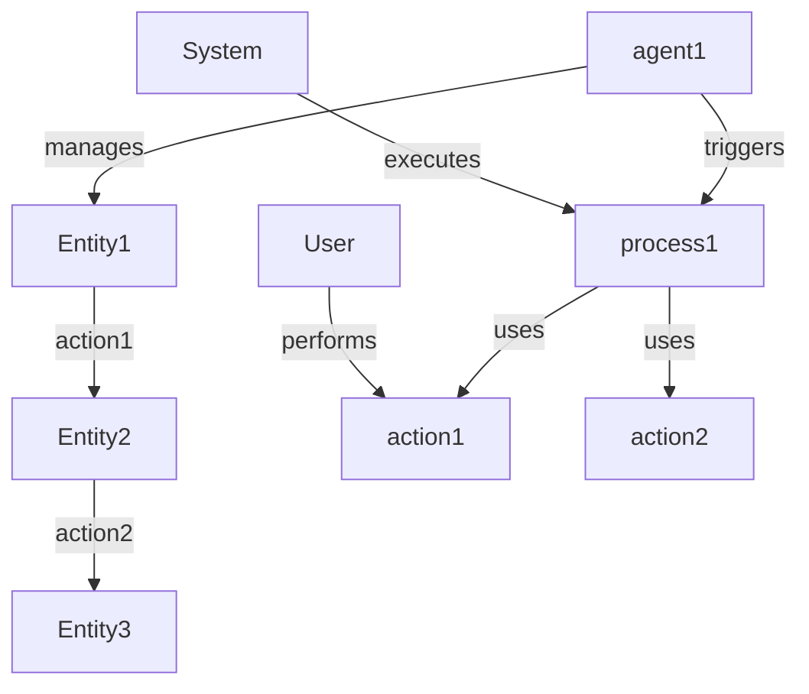

---
# GraphDL Graph → MDXLD Collection Template
# Use this template to define collections/graphs of related entities

$context: http://mdxld.org/context.jsonld
$type: Collection
$id: https://apis.do/collections/COLLECTION-NAME  # Replace COLLECTION-NAME

# Basic Properties
title: Collection Title
description: Brief description of what this collection contains

# Collection Type
collectionType: graph  # graph, list, set, tree, network

# Metadata
metadata:
  ns: collections
  visibility: public
  category: domain  # domain, feature, layer, etc.

# Tags
tags:
  - category1
  - category2

# Related Entities (members of this collection)
relatedTo:
  # Nouns (Things)
  - /types/Entity1
  - /types/Entity2
  - /types/Entity3

  # Verbs (Functions)
  - /functions/action1
  - /functions/action2

  # Workflows
  - /workflows/process1

  # Agents
  - /agents/agent1
---

# Collection Title

Detailed description in Markdown. Explain:
- What this collection represents
- Why these entities are grouped together
- How they relate to each other
- When to use this collection

## Purpose

This collection contains all entities related to [DOMAIN/FEATURE]. It includes:

- **Nouns (Types)** - The entities/data models
- **Verbs (Functions)** - The actions/operations
- **Workflows** - The processes
- **Agents** - The AI agents
- **Relationships** - How they connect

## Architecture

```
┌─────────────────────────────────────────────────┐
│              Collection Name                    │
├─────────────────────────────────────────────────┤
│                                                 │
│  Nouns (Entities/Types)                        │
│  ├─ Entity1 - Description                      │
│  ├─ Entity2 - Description                      │
│  └─ Entity3 - Description                      │
│                                                 │
│  Verbs (Functions/Actions)                     │
│  ├─ action1 - Does X                           │
│  └─ action2 - Does Y                           │
│                                                 │
│  Workflows (Processes)                         │
│  └─ process1 - Multi-step workflow             │
│                                                 │
│  Agents (AI Agents)                            │
│  └─ agent1 - AI-powered automation             │
│                                                 │
└─────────────────────────────────────────────────┘
```

## Entity Types

### Nouns (Data Models)

**Entity1**
- **Purpose:** What this entity represents
- **Properties:** Key properties
- **Relationships:** How it connects
- **Example:** Usage example

**Entity2**
- **Purpose:** What this entity represents
- **Properties:** Key properties
- **Relationships:** How it connects
- **Example:** Usage example

### Verbs (Functions)

**action1**
- **Purpose:** What this function does
- **Subject:** What performs the action (e.g., User, System)
- **Object:** What is acted upon (e.g., Entity1)
- **Output:** What is created/returned
- **Example:** Usage example

**action2**
- **Purpose:** What this function does
- **Subject:** Actor
- **Object:** Target
- **Output:** Result
- **Example:** Usage example

### Workflows

**process1**
- **Trigger:** What starts this workflow
- **Steps:** What happens
- **Output:** End result
- **Example:** Usage example

### Agents

**agent1**
- **Role:** What this agent does
- **Tools:** What tools it can use
- **Capabilities:** What it can do
- **Example:** Usage example

## Relationship Graph



## TypeScript Definitions

```typescript
// Import all types from this collection
export * from './types/Entity1'
export * from './types/Entity2'
export * from './types/Entity3'

// Import all functions
export * from './functions/action1'
export * from './functions/action2'

// Import workflows
export * from './workflows/process1'

// Import agents
export * from './agents/agent1'

// Collection interface
export interface CollectionName {
  entities: {
    Entity1: Entity1[]
    Entity2: Entity2[]
    Entity3: Entity3[]
  }
  functions: {
    action1: typeof action1
    action2: typeof action2
  }
  workflows: {
    process1: typeof process1
  }
  agents: {
    agent1: typeof agent1
  }
}
```

## Usage Examples

### Query the Collection

```typescript
// Get all entities in this collection
const collection = await db.query(`
  SELECT DISTINCT t.*
  FROM things t
  JOIN relationships r ON (r.fromNs = t.ns AND r.fromId = t.id)
  WHERE r.toNs = 'collections'
    AND r.toId = 'collection-name'
    AND r.type = 'partOf'
`)

// Returns array of all entities in the collection
```

### Use Collection Functions

```typescript
import { action1, action2 } from '@dot-do/collection-name'

// Execute action1
const result1 = await action1({
  input: 'data'
})

// Chain actions
const result2 = await action2({
  input: result1.output
})
```

### Execute Workflow

```typescript
import { process1 } from '@dot-do/collection-name/workflows'

// Trigger workflow
await process1({
  triggerData: {
    entity1Id: 'entity-123'
  }
})
```

### Interact with Agent

```typescript
import { agent1 } from '@dot-do/collection-name/agents'

// Send message to agent
const response = await agent1.chat({
  message: 'What is the status of entity-123?',
  context: {
    userId: 'user-456'
  }
})
```

## API Endpoints

The collection exposes these endpoints:

```
GET    /collections/collection-name          - List all entities
GET    /collections/collection-name/types    - List entity types
GET    /collections/collection-name/functions - List functions
POST   /collections/collection-name/query    - Graph query
```

### Example API Query

```bash
# Get all entities in collection
curl https://apis.do/collections/collection-name

# Query relationships
curl -X POST https://apis.do/collections/collection-name/query \
  -H "Content-Type: application/json" \
  -d '{
    "query": "MATCH (n)-[r]->(m) WHERE n.type = '\''Entity1'\'' RETURN n, r, m",
    "limit": 100
  }'
```

## Testing

```typescript test
import { describe, it, expect } from 'vitest'
import { action1, action2 } from './collection-name'

describe('Collection: collection-name', () => {
  it('exports all entities', () => {
    expect(action1).toBeDefined()
    expect(action2).toBeDefined()
  })

  it('functions work together', async () => {
    const result1 = await action1({ input: 'test' })
    const result2 = await action2({ input: result1.output })

    expect(result2).toBeDefined()
  })

  it('maintains relationships', async () => {
    // Test that entities are properly connected
    const relationships = await db.relationships.findAll({
      toNs: 'collections',
      toId: 'collection-name'
    })

    expect(relationships.length).toBeGreaterThan(0)
  })
})
```

## Extension Points

This collection can be extended by:

1. **Adding new entities** - Create new Thing files and link to collection
2. **Adding new functions** - Create new Function files with collection relationship
3. **Adding new workflows** - Compose existing functions into new workflows
4. **Adding new agents** - Create agents that use collection tools

## GraphDL Comparison

**Old (GraphDL):**
```yaml
graph: CollectionName
  nouns:
    Entity1:
      properties: {...}
    Entity2:
      properties: {...}

  verbs:
    action1:
      subject: User
      object: Entity1
    action2:
      subject: System
      object: Entity2
```

**New (MDXLD):**

This collection file + individual entity files:
- `types/Entity1.mdx`
- `types/Entity2.mdx`
- `functions/action1.mdx`
- `functions/action2.mdx`

All linked via `relatedTo` relationships in frontmatter.

## See Also

- [Thing Template](./noun-thing-template.mdx) - Create entities
- [Function Template](./verb-function-template.mdx) - Create actions
- [Workflow Template](./workflow-template.mdx) - Create processes
