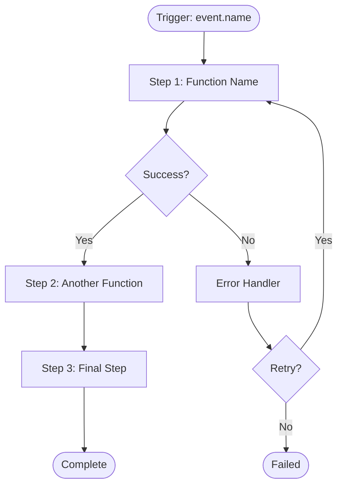

---
# MDXLD Workflow Template
# Use this template to define multi-step processes with triggers and automation

$context: http://mdxld.org/context.jsonld
$type: Workflow
$id: https://apis.do/workflows/WORKFLOW-NAME  # Replace WORKFLOW-NAME

# Basic Properties
title: Workflow Title
description: Brief description of what this workflow does
version: 1.0.0

# Trigger Configuration
trigger:
  type: webhook  # webhook, schedule, event, manual
  event: event.name  # Event name that triggers this workflow
  schedule: null  # Cron expression for scheduled workflows
  schema:  # Schema for trigger data
    type: object
    properties:
      param1:
        type: string
      param2:
        type: number
    required: [param1]

# Workflow Steps
steps:
  - id: step1
    title: First Step
    type: function  # function, api-call, database, wait, branch, schedule
    function: https://apis.do/functions/function-name
    inputs:
      input1: "{{trigger.param1}}"  # Template variables
      input2: "{{trigger.param2}}"
    timeout: 30000  # 30 seconds
    retry:
      attempts: 3
      backoff: exponential

  - id: step2
    title: Second Step
    type: function
    function: https://apis.do/functions/another-function
    inputs:
      data: "{{steps.step1.output}}"
    continueOnError: false

# Workflow Configuration
concurrency: sequential  # sequential, parallel, max-concurrent
timeout: 300000  # 5 minutes total
retry:
  attempts: 3
  backoff: exponential

# Metadata
metadata:
  ns: workflows
  visibility: public
  category: automation  # automation, integration, business-process, etc.

# Tags
tags:
  - category1
  - category2

# Related Entities
relatedTo:
  - /functions/function1
  - /functions/function2
  - /agents/agent1
---

# Workflow Title

Detailed description in Markdown. Explain:
- What this workflow does end-to-end
- When it should be triggered
- What the expected outcome is
- Prerequisites and dependencies

## Purpose

This workflow orchestrates [BUSINESS PROCESS] by coordinating multiple functions
and services to achieve [GOAL].

## Workflow Diagram



## Steps Breakdown

### Step 1: First Step

**What it does:**
- Validates trigger data
- Calls function-name with inputs
- Transforms output for next step

**Inputs:**
- `input1`: From trigger.param1
- `input2`: From trigger.param2

**Outputs:**
- `output`: Result object

**Error Handling:**
- Retries 3 times with exponential backoff
- Fails workflow if all retries exhausted

### Step 2: Second Step

**What it does:**
- Takes output from Step 1
- Processes data with another-function
- Continues even if errors occur

**Inputs:**
- `data`: From steps.step1.output

**Outputs:**
- `result`: Processed result

**Error Handling:**
- Continues on error (continueOnError: true)
- Logs error for review

### Step 3: Final Step

**What it does:**
- Completes the workflow
- Sends notifications
- Updates database

## Implementation

```typescript
import { WorkflowEngine, Step, Trigger } from '@mdxld/workflow'
import { function1 } from '../functions/function1'
import { function2 } from '../functions/function2'

// Workflow configuration
export const workflowName = new WorkflowEngine({
  id: 'workflow-name',

  trigger: {
    type: 'webhook',
    event: 'event.name',
    schema: {
      type: 'object',
      properties: {
        param1: { type: 'string' },
        param2: { type: 'number' }
      },
      required: ['param1']
    }
  },

  steps: [
    {
      id: 'step1',
      title: 'First Step',
      run: async (context) => {
        const { param1, param2 } = context.trigger

        const result = await function1({
          input1: param1,
          input2: param2 || 0
        })

        return result
      },
      retry: {
        attempts: 3,
        backoff: 'exponential'
      },
      timeout: 30000
    },

    {
      id: 'step2',
      title: 'Second Step',
      run: async (context) => {
        const step1Output = context.steps['step1']

        const result = await function2({
          data: step1Output.output
        })

        return result
      },
      continueOnError: true
    },

    {
      id: 'step3',
      title: 'Final Step',
      run: async (context) => {
        const step2Output = context.steps['step2']

        // Send notification
        await sendNotification({
          message: 'Workflow completed',
          data: step2Output
        })

        // Update database
        await db.workflows.updateStatus({
          workflowId: context.instanceId,
          status: 'completed'
        })

        return {
          success: true,
          message: 'Workflow completed successfully'
        }
      }
    }
  ],

  concurrency: 'sequential',
  timeout: 300000,

  retry: {
    attempts: 3,
    backoff: 'exponential'
  },

  onError: async (error, context) => {
    // Error handler
    console.error('Workflow failed:', error)

    await sendAlert({
      type: 'workflow-error',
      workflow: 'workflow-name',
      error: error.message,
      context
    })
  },

  onComplete: async (result, context) => {
    // Completion handler
    console.log('Workflow completed:', result)

    await track('workflow.completed', {
      workflow: 'workflow-name',
      duration: context.duration,
      steps: context.completedSteps.length
    })
  }
})

// Helper function to trigger workflow
export async function triggerWorkflow(data: {
  param1: string
  param2?: number
}) {
  return await workflowName.trigger(data)
}
```

## Usage Examples

### Trigger via Webhook

```bash
curl -X POST https://apis.do/workflows/workflow-name/trigger \
  -H "Content-Type: application/json" \
  -d '{
    "param1": "example",
    "param2": 42
  }'
```

### Trigger Programmatically

```typescript
import { triggerWorkflow } from './workflows/workflow-name'

const result = await triggerWorkflow({
  param1: 'example',
  param2: 42
})

console.log('Workflow instance:', result.instanceId)
```

### Monitor Workflow

```typescript
import { WorkflowEngine } from '@mdxld/workflow'

// Get status
const status = await WorkflowEngine.getStatus('workflow-name', instanceId)

console.log(status)
// {
//   workflowId: 'workflow-name',
//   instanceId: 'run-123',
//   status: 'running',
//   currentStep: 'step2',
//   completedSteps: ['step1'],
//   startedAt: '2025-10-02T10:00:00Z',
//   progress: 0.5
// }
```

### Cancel Workflow

```typescript
// Cancel running workflow
await WorkflowEngine.cancel('workflow-name', instanceId)
```

### Retry Failed Step

```typescript
// Retry specific step that failed
await WorkflowEngine.retryStep('workflow-name', instanceId, 'step2')
```

## Testing

```typescript test
import { describe, test, expect, beforeEach, vi } from 'vitest'
import { workflowName } from './workflow-name'
import { WorkflowTestHarness } from '@mdxld/workflow/testing'

describe('Workflow: workflow-name', () => {
  let harness: WorkflowTestHarness

  beforeEach(() => {
    harness = new WorkflowTestHarness(workflowName)
  })

  test('completes successfully with valid inputs', async () => {
    const result = await harness
      .trigger({
        param1: 'test',
        param2: 123
      })
      .run()

    expect(result.status).toBe('completed')
    expect(result.completedSteps).toHaveLength(3)
  })

  test('handles step failures with retry', async () => {
    const mockFunction = vi
      .fn()
      .mockRejectedValueOnce(new Error('Network error'))
      .mockResolvedValue({ output: 'success' })

    const result = await harness
      .trigger({ param1: 'test' })
      .mock('step1', mockFunction)
      .run()

    expect(mockFunction).toHaveBeenCalledTimes(2)
    expect(result.status).toBe('completed')
  })

  test('continues on error when configured', async () => {
    const result = await harness
      .trigger({ param1: 'test' })
      .failStep('step2', new Error('Step 2 failed'))
      .run()

    expect(result.status).toBe('completed')
    expect(result.errors).toHaveLength(1)
    expect(result.completedSteps).toContain('step3')
  })

  test('times out after configured duration', async () => {
    const result = await harness
      .trigger({ param1: 'test' })
      .waitFor(400000) // > 300s timeout
      .run()

    expect(result.status).toBe('timeout')
  })
})
```

## Monitoring & Analytics

```typescript
// Get workflow analytics
const analytics = await WorkflowEngine.getAnalytics('workflow-name', {
  startDate: '2025-10-01',
  endDate: '2025-10-02'
})

console.log(analytics)
// {
//   totalRuns: 150,
//   completed: 142,
//   failed: 5,
//   running: 3,
//   averageDuration: 45000, // ms
//   successRate: 0.95,
//   stepMetrics: {
//     step1: { success: 150, failed: 0, avgDuration: 1500 },
//     step2: { success: 145, failed: 5, avgDuration: 2300 },
//     step3: { success: 142, failed: 0, avgDuration: 800 }
//   }
// }
```

## Error Handling

### Retry Logic

Steps with retry configuration automatically retry on failure:

```typescript
retry: {
  attempts: 3,           // Retry up to 3 times
  backoff: 'exponential' // 1s, 2s, 4s, 8s...
}
```

### Continue on Error

Non-critical steps can continue even if they fail:

```typescript
{
  id: 'optional-step',
  continueOnError: true  // Workflow continues even if this fails
}
```

### Timeout Handling

Steps and workflows can have timeouts:

```typescript
{
  timeout: 30000,  // 30 seconds
  onTimeout: async () => {
    // Fallback action
  }
}
```

## Environment Variables

| Variable | Required | Description |
|----------|----------|-------------|
| `WORKFLOW_TIMEOUT` | No | Override default timeout |
| `WORKFLOW_RETRY_ATTEMPTS` | No | Override retry attempts |

## Performance

- **Average Duration:** 45 seconds
- **Success Rate:** 95%
- **Throughput:** 100 executions/minute
- **Concurrency:** 10 parallel instances

## GraphDL Comparison

**Old (GraphDL):**
```yaml
workflows:
  workflowName:
    trigger: event.name
    steps:
      - call: function1
        with: {...}
      - call: function2
        with: {...}
```

**New (MDXLD):**
This file! Full TypeScript control with type safety, testing, and monitoring.

## See Also

- [Function Template](./verb-function-template.mdx) - Individual functions
- [Agent Template](./agent-template.mdx) - AI agents
- [Collection Template](./graph-collection-template.mdx) - Related entities
